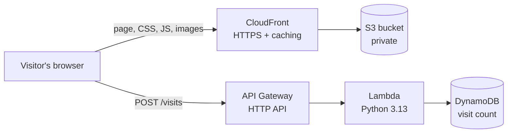

# Portfolio on AWS (Cloud Resume Challenge)

My portfolio website, hosted on AWS as a serverless application and defined as code with AWS SAM.

**Live site:** https://d25ggs8kflzmtl.cloudfront.net

## Architecture



| Part | Service | What it does |
|---|---|---|
| Website files | S3 | Stores the HTML, CSS, JS and images. The bucket is private. |
| Delivery and HTTPS | CloudFront | Serves the site worldwide, redirects HTTP to HTTPS, compresses files and adds security headers. It reads the bucket through Origin Access Control, so the bucket only accepts requests from this one distribution. |
| Counter API | API Gateway (HTTP API) | Gives the Lambda function a public URL. CORS only allows the site's own addresses, and requests are throttled. |
| Counter logic | Lambda | Adds 1 to the count and returns the new total. Its IAM role allows only `UpdateItem` on the one table. |
| Counter storage | DynamoDB | Holds a single item with the visit count. The update is atomic, so simultaneous visits are all counted. |
| Infrastructure as code | AWS SAM | `template.yaml` defines every resource above. |
| Tests | GitHub Actions | Runs the Lambda unit tests on every push and pull request. |

Everything runs in `eu-north-1` (Stockholm).

## Repository layout

```
site/                     The website (uploaded to S3)
backend/counter/app.py    Lambda function for the visitor counter
backend/tests/            Unit tests for the Lambda function
template.yaml             SAM template: bucket, CloudFront, API, Lambda, table
samconfig.toml            Saved settings for `sam deploy`
deploy.ps1                One-command deployment script
cicd/github-oidc.yaml     OIDC provider and deploy role for GitHub Actions (not deployed, see below)
.github/workflows/        Test workflow
vercel.json               Points the Vercel copy of the site at site/
```

## Deploying

Requirements: the AWS CLI, the AWS SAM CLI, and an AWS profile that is signed in.

```powershell
aws login --profile myprofile
.\deploy.ps1
```

The script does three things:

1. `sam deploy` creates or updates the infrastructure.
2. `aws s3 sync` uploads `site/` to the bucket.
3. A CloudFront invalidation clears the cache so visitors get the new files.

## Running the tests

```bash
pip install -r backend/requirements-dev.txt
pytest backend/tests
```

## Why deployment is not fully automatic

The pipeline was designed to deploy from GitHub Actions using OIDC: GitHub proves its identity to AWS with a short-lived token and assumes an IAM role that only this repository's `main` branch can use, so no AWS keys are stored in GitHub. That role is defined in `cicd/github-oidc.yaml`.

The AWS account is on the Free plan inside an AWS-managed organization, and its service control policy denies `iam:CreateOpenIDConnectProvider`. I chose not to fall back to long-lived access keys in GitHub secrets. So GitHub Actions runs the tests, and `deploy.ps1` runs the same deployment steps from a signed-in machine.

## Cost

At portfolio traffic the stack stays inside the AWS free allowances: CloudFront, Lambda and DynamoDB (1 read and 1 write unit) are covered by their always-free tiers, and S3 and API Gateway usage is a fraction of a cent. A $1 monthly AWS Budget sends an email alert if that changes.

## Possible next steps

- Custom domain with an ACM certificate and Route 53.
- Enable the OIDC deployment workflow once the account allows it.
- Count unique visitors instead of page loads.
